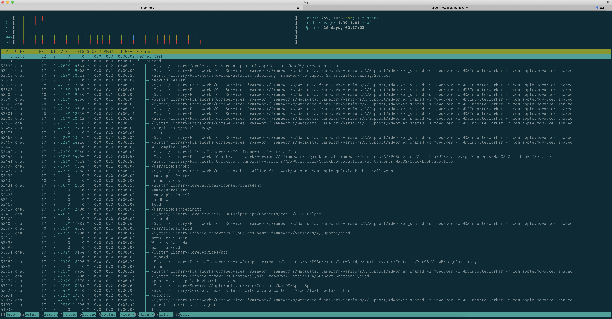

## Show information related to CPU, MEM, etc

Tutorial: https://github.com/chaupmcs/show_cpu_mem_info/blob/master/Python_Profiling.pdf

https://nbviewer.jupyter.org/github/chaupmcs/show_cpu_mem_info/blob/master/CPU_MEM_info.ipynb?flush_cache=true

